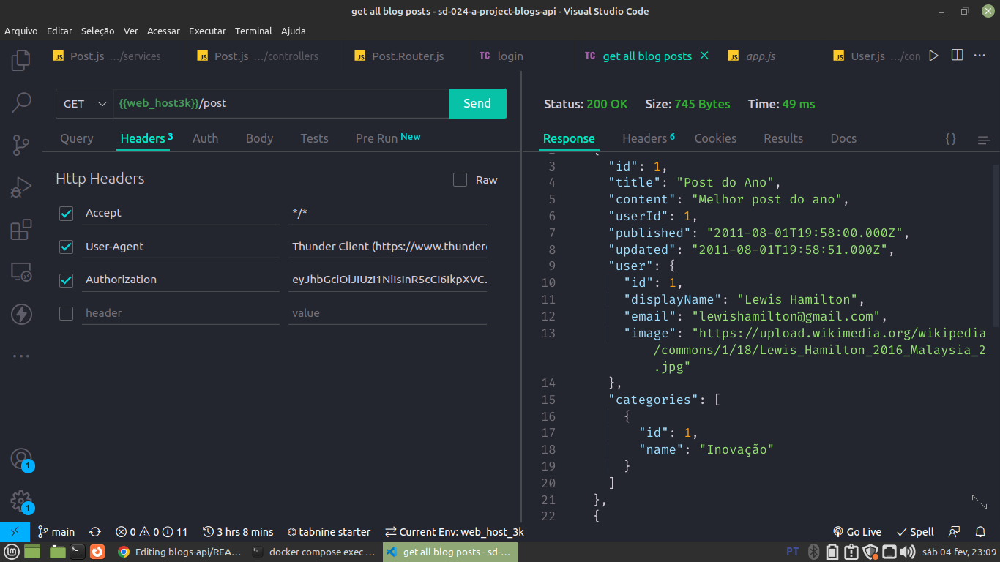
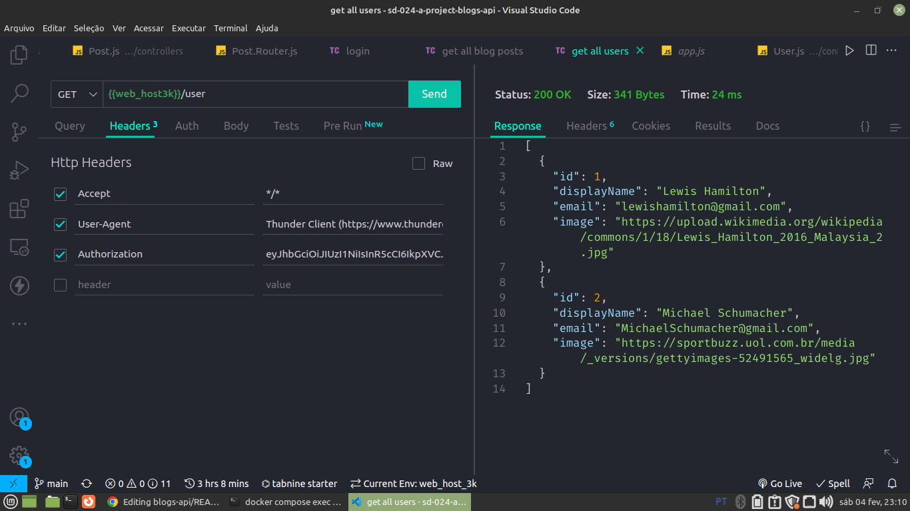

# Projeto Blogs API :computer:

Criação de um back-end conectado a um banco de dados MySQL para uma aplicação de blog, onde é possível criar, ler, atualizar e excluir postagens.
Criar e excuir usuários.

## Tecnologias usadas no projeto:

## Endpoints:
:warning: Atenção. Os endpoints que tiverem o símbolo :lock: necessitam de um token de validação nos headers da requisição.

- `POST /login`: Faz login na aplicação. Recebe duas propriedades, email e password. Retorna o token gerado pelo JWT.
- `POST /user`: Cadastra um novo usuário. Recebe três propriedades, displayName, email e password. Retorna o token gerado pelo JWT.
- :lock: `GET /user`: Retorna uma lista com todos os usuários cadastrados.
- :lock: `GET /user/:id`: Retorna um usuário que corresponde ao id passado no endpoint.
- :lock: `DELETE /user/me`: Deleta o usuário que fez a requisição.
- :lock: `GET /categories`: Retorna uma lista com todas as categorias cadastradas.
- :lock: `POST /categories`: Cadastra uma nova categoria. Recebe uma propriedade: name. Retorna um objeto com o nome e o id da categoria cadastrada
- :lock: `GET /post`: Retorna uma lista com todos os posts cadastrados.
- :lock: `GET /post/:id`: Retorna um post que corresponde ao id passado no endpoint.
- :lock: `GET /post/search?q=<palavra>`: Retorna uma lista com todos os posts que tiverem em seu titulo ou conteúdo a palavra passada no endpoint.
- :lock: `POST /post`: Cadastra um novo post. Recebe três propriedades, title, content e categryIds. Retorna um objeto com os dados do post cadastrado.
- :lock: `PUT /post/:id`: Atualiza o titulo e/ou o conteúdo do post. Recebe duas propriedades, title e content. Retorna um objeto com os dados do post atualizado.
- :lock: `DELETE /post/:id`: Deleta um post com base no id passado no endpoint. Retorna um status 204.

## Imagens:

<!-- Olá, Tryber!
Esse é apenas um arquivo inicial para o README do seu projeto.
É essencial que você preencha esse documento por conta própria, ok?
Não deixe de usar nossas dicas de escrita de README de projetos, e deixe sua criatividade brilhar!
:warning: IMPORTANTE: você precisa deixar nítido:
- quais arquivos/pastas foram desenvolvidos por você; 
- quais arquivos/pastas foram desenvolvidos por outra pessoa estudante;
- quais arquivos/pastas foram desenvolvidos pela Trybe.
-->
